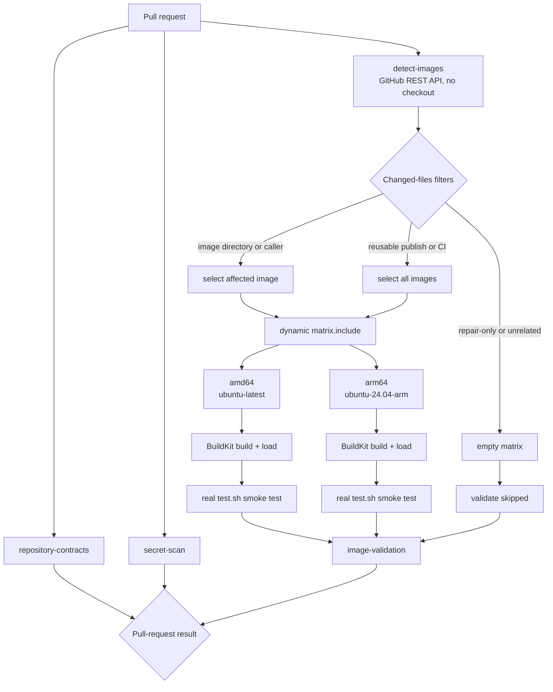
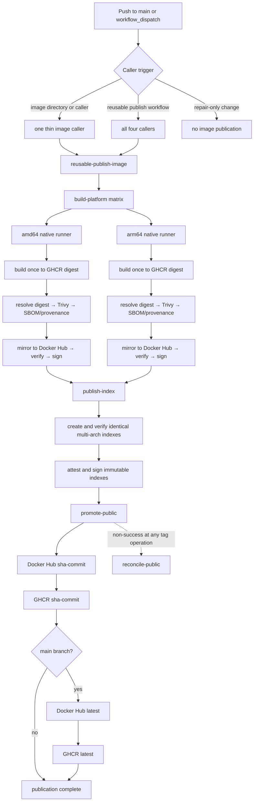
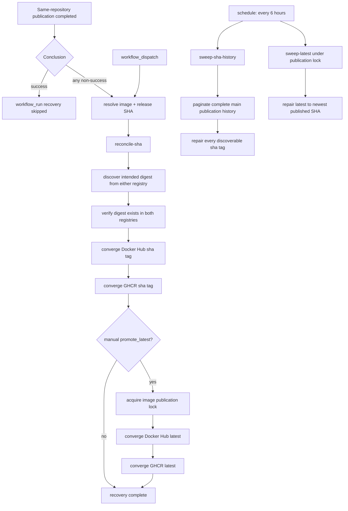

# Repository architecture

This document is the contract for adding, publishing, maintaining, and removing
images in `forge-images`.

## Design goals

- One independently useful product per image.
- One canonical name from source directory to registry.
- One validation model and one publication model for every image.
- Build and test both `linux/amd64` and `linux/arm64`.
- Keep image-specific behavior beside its Dockerfile.
- Keep shared supply-chain behavior in one reusable workflow.

The repository deliberately does not use an image manifest generator, Makefile,
or a configurable publication framework. Four explicit callers and one shared
workflow are easier to inspect and operate.

## Three layers

### 1. Image directory

Each image is self-contained at the repository root:

```text
<image>/
├── Dockerfile
├── .dockerignore
├── README.md
├── test.sh
└── image-specific files
```

Responsibilities:

- `Dockerfile` defines image contents and runtime defaults.
- `.dockerignore` limits the build context.
- `test.sh IMAGE` validates a real built image, not workflow text.
- `README.md` owns product-specific usage, configuration, and contents.

`test.sh` must be executable and work for both supported architectures.

### 2. Pull-request validation

`.github/workflows/ci.yml` is the only pull-request workflow. It validates
repository policy, scans for secrets, and builds/tests every changed image for
both architectures.

A checkout-free preflight queries pull-request changed files once and creates
only the affected image's amd64 and arm64 jobs. A caller change validates its
image; changes to the reusable publication workflow or CI validate all images.
Reconciliation workflow and script changes run policy, syntax, and executable
repair fixtures without building images. The fixed `image-validation` summary
job keeps the image check name stable even when the dynamic matrix is empty.

#### Pull-request Actions flow



Platform jobs run natively: amd64 uses `ubuntu-latest` and arm64 uses
`ubuntu-24.04-arm`, without QEMU emulation. PR builds may read the publication
`<image>-<arch>` cache and their own `ci-<image>-<arch>` cache, but write only to
the `ci-*` scope. Cache hits skip repeated BuildKit work; they never replace the
loaded-image smoke test on either architecture.

### 3. Publication

Each image has a thin caller at `.github/workflows/<image>.yml`. All callers use
`.github/workflows/reusable-publish-image.yml`, which owns the complete
publication sequence. A caller publishes only when its image directory, its own
workflow, or the reusable publication workflow changes; repair-only changes do
not rebuild images.

#### Publication Actions flow



Per platform:

```text
build once in GHCR
→ resolve exact platform image digest
→ Trivy SARIF scan
→ SPDX SBOM and provenance attestations
→ copy immutable digest to Docker Hub
→ verify mirror digest equality
→ sign both registry digests
```

After both platforms succeed:

```text
create identical multi-architecture indexes
→ verify index digest equality
→ attest and sign immutable indexes
→ create sha-<commit>
→ update latest
```

GHCR is canonical. Docker Hub is a digest-identical mirror, not a second build.
Each platform image manifest receives SPDX SBOM and build-provenance
attestations on GHCR. The final multi-architecture index receives build
provenance and signatures, but no synthetic top-level SPDX SBOM. Docker Hub
receives mirrored manifests and signatures.

Public `sha-*` and `latest` tags converge through one shared idempotent script.
It writes Docker Hub first and GHCR last, retries transient registry failures
with bounded backoff, and treats GHCR as the commit point when repairing a
split tag. Successful promotion is already verified by that script and does not
run an immediate repair or a second `workflow_run` recovery. Failed or cancelled
publication starts `.github/workflows/reconcile-public-tags.yml`, and operators
can rerun it manually without rebuilding. Every six hours it also paginates
through the complete main-branch publication history and repairs every
discoverable `sha-*` reference, so a pending job displaced by later publications
is re-enqueued from durable GitHub run history. A separate sweep repairs
`latest` to the newest published SHA while holding the image's publication
concurrency group.

#### Recovery Actions flow



Keyless signature verification uses the reusable workflow identity:

```text
https://github.com/mrgeneralgoo/forge-images/.github/workflows/reusable-publish-image.yml@refs/heads/main
```

Example:

```bash
IMAGE=ghcr.io/mrgeneralgoo/fava
DIGEST=sha256:<release-index-digest>
cosign verify \
  --certificate-identity \
  'https://github.com/mrgeneralgoo/forge-images/.github/workflows/reusable-publish-image.yml@refs/heads/main' \
  --certificate-oidc-issuer https://token.actions.githubusercontent.com \
  "$IMAGE@$DIGEST"
```

Resolve a platform descriptor from the raw release index before verifying its
SPDX or per-platform provenance attestation. Never use the GitHub artifact
archive digest or the intermediate BuildKit output index as an OCI subject.

See [the vulnerability policy](.github/vulnerability-policy.md) for scan
semantics.

## Image admission criteria

An image belongs in this repository only if at least one condition is true:

1. It is a directly deployable product.
2. It has multiple independent consumers.
3. It encapsulates a costly or substantial reusable build environment.
4. It has an independent release lifecycle that consumers pin by digest.

Do not add a public image for a thin one-consumer base such as an upstream image
plus a few package-install lines. Put that logic in the consuming repository.
If one product always consumes another intermediate image, collapse the layers
unless the intermediate has independent consumers.

## Naming

Use one lowercase kebab-case slug:

```text
<product>[-<runtime-or-role>]
```

The same slug must be used everywhere:

| Surface | Example |
|---|---|
| Directory | `wordpress-frankenphp/` |
| Caller workflow | `.github/workflows/wordpress-frankenphp.yml` |
| Workflow input | `image: wordpress-frankenphp` |
| Cache scope | `wordpress-frankenphp-arm64` |
| SARIF category | `wordpress-frankenphp-arm64` |
| Concurrency group | `publish-wordpress-frankenphp` |
| GHCR | `ghcr.io/mrgeneralgoo/wordpress-frankenphp` |
| Docker Hub | `docker.io/mrgeneralgoo/wordpress-frankenphp` |

Use a product name alone for a final product (`fava`, `dae`). Add a suffix only
when it communicates a real consumer-visible runtime or role
(`wordpress-frankenphp`, `mapservice-build`). Do not put registry, environment,
architecture, or version in the image name.

## Tags and architectures

Every image publishes one OCI index containing:

- `linux/amd64`
- `linux/arm64`

Public references are:

- `latest`: the last complete successful publication from `main`.
- `sha-<git-commit>`: a traceable commit reference.
- `@sha256:<digest>`: the immutable production reference.

Do not add architecture tags, date tags, `stable`, `edge`, or environment tags
without a demonstrated consumer requirement.

## Dependency and metadata policy

- Pin every `FROM` image and GitHub Action by digest.
- Prefer the widest upstream tag that still keeps the image correct, and let the
  digest do the pinning. A tag narrow enough to be frozen by upstream (an exact
  patch tag such as `golang:1.27.0-trixie`) stops receiving digest updates once
  the next patch ships, which silently ends security updates while CI stays
  green. Narrow the tag only for a stated reason, such as `golang:trixie` keeping
  the build stage aligned with the `debian:trixie-slim` runtime.
- A digest literal must appear exactly once per upstream image. When an image is
  referenced only by its `FROM` line, that line is the single copy and needs
  nothing further. When the digest is also needed in a label or a file baked into
  the image, declare it once as `ARG <NAME>_REF=image:tag@sha256:...` before the
  first `FROM`, build with `FROM ${<NAME>_REF}`, and derive every other mention
  (`${<NAME>_REF##*@}` for the digest, `${<NAME>_REF%%@*}` for the tagged name).
  A second literal copy is a pin Renovate will not update, and it drifts silently
  because nothing compares the copies against each other.
- Pin direct language/tool dependencies where their manager supports it.
- Let Renovate update pins. Digest updates merge automatically once CI is green:
  the image content is what `test.sh` validates, and a digest bump carries no
  information a human reviewer could check by reading the diff. Renovate waits
  for the status checks before merging, so a failing `test.sh` still blocks it.
- Version changes to the protected families in `renovate.json` still require a
  human. A new upstream version can change behaviour in ways a digest refresh
  of the same tag cannot, and for source-built components it also needs the
  commit and checksum pins updated in the same change.
- Accepted risk: because these images track unbounded floating tags, a digest
  update can itself carry a major upstream jump — a new Go, WordPress or PHP
  release arrives as a changed checksum on the same tag, merges automatically
  and publishes. `test.sh` proves the image builds, boots and serves; it does
  not prove a consumer still compiles or runs against the new version, and it
  deliberately does not assert versions. This is a deliberate trade for keeping
  security updates flowing without human latency: consumers pin these images by
  digest and gate their own upgrades. If that stops being acceptable for a given
  image, narrow its tag to a version channel (`golang:1.27-trixie`,
  `wordpress:7-php8.3-apache`) — digest updates stay automatic within the
  channel, and crossing it becomes a deliberate one-line change.
- Every Dockerfile accepts `ARG VCS_REF=unknown` and records
  `org.opencontainers.image.source` and
  `org.opencontainers.image.revision` labels.
- Add title, description, license, and upstream digest labels where they have
  clear product-level meanings. Do not add a version label to an image that
  tracks a floating tag; the version is not stable enough to state and would
  have to be hand-edited on every upstream release.
- `test.sh` validates the built image, never the Dockerfile's version text. It
  reads pins from the Dockerfile and checks that the image agrees with them; it
  must not hardcode an upstream version or digest, because that turns every
  upstream release into a red pull request.
- Copy upstream license files into `/usr/share/doc` from whatever source already
  carries them; do not download a source archive solely to obtain a license.
- Never bake credentials, deployment configuration, or consumer data into an
  image.

## Adding an image

1. Confirm that it satisfies the admission criteria.
2. Choose one unused lowercase kebab-case slug.
3. Add the mandatory directory files and architecture-neutral smoke test.
4. Verify every pinned upstream has amd64 and arm64 manifests.
5. Add a thin caller copied from an existing retained image and change only the
   slug, display name, and path.
6. Add the slug to the CI changed-files filters, matrix builder, and
   repository layout contract.
7. Add a preview row to the root README and keep detailed usage in the image
   README.
8. Add protected Renovate packages only when a *version* change needs manual
   review. Digest updates automerge for every image.
9. Build and test both architectures before advertising the image.

Do not add scan/sign/attest switches. Those are repository guarantees.

## Removing an image

1. Find repository and external consumers.
2. Migrate consumers or confirm that pinned historical digests are sufficient.
3. Remove the image directory, caller, CI matrix entry, Renovate rules, and
   documentation together.
4. Stop publishing new tags.
5. Do not delete remote immutable digests as part of source cleanup unless a
   separate destructive migration explicitly requires it.

## Local verification

For an available architecture:

```bash
docker buildx build --platform linux/amd64 --load \
  -t test-fava fava
./fava/test.sh test-fava
```

Use `linux/arm64` and a distinct test tag for the second platform. CI performs
this pair for every changed image.

Syntax and policy checks:

```bash
for file in $(git ls-files '*.sh'); do bash -n "$file"; done
PYTHONPYCACHEPREFIX="$CLAUDE_JOB_DIR/tmp/pycache" \
  python3 -m py_compile dae/convert-rules.py fava/fava_wsgi.py
jq -e . renovate.json
```

The shared publication workflow must continue to preserve exact platform digest
resolution, scan-before-promotion, mirror equality, immutable attestation and
signature subjects, and `sha` before `latest` promotion.
