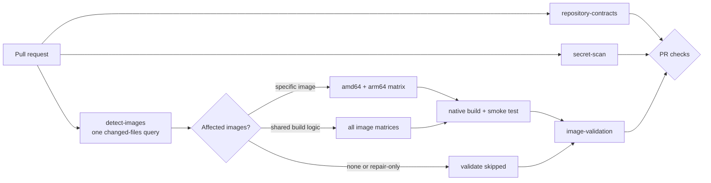

# forge-images

A small collection of pinned, multi-architecture Docker images for running
services and providing a reproducible Go build environment.

## Images

All images publish `linux/amd64` and `linux/arm64` to both registries through the
same hardened workflow. Product-specific details live in each image directory.

| Image | Use | Documentation |
|---|---|---|
| [`dae`](dae/) | dae eBPF transparent proxy with managed rule and GeoData updates | [`dae/README.md`](dae/README.md) |
| [`fava`](fava/) | Fava accounting web UI served by preloaded Gunicorn | [`fava/README.md`](fava/README.md) |
| [`mapservice-build`](mapservice-build/) | Pinned Go, CGO, StormLib, sqlc, and golangci-lint build environment | [`mapservice-build/README.md`](mapservice-build/README.md) |
| [`wordpress-frankenphp`](wordpress-frankenphp/) | WordPress core on FrankenPHP with curated PHP extensions | [`wordpress-frankenphp/README.md`](wordpress-frankenphp/README.md) |

Canonical image names use the directory slug:

```text
ghcr.io/mrgeneralgoo/<image>
docker.io/mrgeneralgoo/<image>
```

## Common publication contract

Every pull request queries changed files once, then creates native amd64 and
arm64 build/smoke-test jobs only for affected images. Changes limited to tag
reconciliation run policy and recovery fixtures without building images. Every
main-branch publication:



1. Builds each architecture once in GHCR by digest.
2. Resolves the exact platform image manifest, excluding attestation manifests.
3. Scans the immutable digest with Trivy and uploads SARIF.
4. Attests the platform SPDX SBOM and build provenance on GHCR.
5. Copies the exact digest to Docker Hub and verifies digest equality.
6. Signs both registry digests with Cosign.
7. Creates and verifies an identical two-platform index in both registries.
8. Signs and attests the final index, then creates `sha-<commit>`.
9. Updates `latest` only after all previous gates pass.

Vulnerability findings are informational; scanner, registry, attestation, and
signing operational failures remain fatal. Public tag updates use bounded
retries. Successful promotion does not run duplicate repair work; failed or
cancelled publication starts the independent reconciliation workflow. Manual
recovery and scheduled full-history sweeps remain available, so partial
cross-registry promotion can be recovered without rebuilding. See
[`.github/vulnerability-policy.md`](.github/vulnerability-policy.md).

For the naming, directory, architecture, dependency, and onboarding contract,
see [`ARCHITECTURE.md`](ARCHITECTURE.md).

## Tags and immutable use

- `latest` tracks the last complete publication from `main`.
- `sha-<commit>` identifies a source commit.
- `@sha256:<digest>` is the immutable production reference.

Use a digest in deployments:

```bash
docker pull ghcr.io/mrgeneralgoo/fava@sha256:<digest>
```

The repository does not create architecture-specific tags, date tags, or
environment tags. The OCI index selects amd64 or arm64 automatically.

## Adding or removing images

Read [`ARCHITECTURE.md`](ARCHITECTURE.md) before adding an image. In short, each
image must be an independently useful product or a substantial reusable build
environment, contain a Dockerfile, `.dockerignore`, executable `test.sh`, and
its own README, and pass both architecture builds.

Thin one-consumer base images belong in the consuming product rather than as a
separate public image.

## Retired images

`openclaw`, `pkm-mcp`, and the standalone `frankenphp` image are no longer built
from this repository. Existing remote packages and tags are not deleted by this
source refactor, but stopping publication does not guarantee registry retention
or continued availability. New retained-image releases use the standardized
full `sha-<git-commit>` tag format; older tags are not removed.

## License

Repository-authored files are Apache-2.0 licensed; see [`LICENSE`](LICENSE) and
[`NOTICE.md`](NOTICE.md). Bundled upstream components retain their own licenses,
which are documented by each image.
